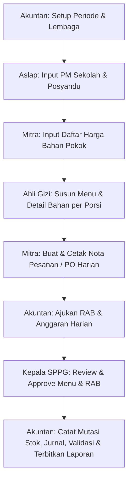

# Spesifikasi Sistem & Alur Kerja SPPG (Untuk Perancangan UI/UX)

Dokumen ini disusun untuk memberikan gambaran arsitektur sistem, skema database, teknologi yang digunakan, serta alur kerja antar-role agar agen desainer UI/UX dapat merancang antarmuka pengguna yang terstruktur dan selaras dengan logika sistem.

---

## 🛠️ 1. Tech Stack (Teknologi yang Digunakan)

Aplikasi dibangun dengan arsitektur **Client-Server** yang berkomunikasi melalui REST API secara real-time:
*   **Backend**: Node.js (Express.js) menggunakan **Prisma Client** (ORM) untuk berkomunikasi langsung dengan database relasional **PostgreSQL**.
*   **Frontend**: React.js dengan bundler **Vite** dan **React Router v6** untuk navigasi halaman (*Routing*).
*   **Keamanan & Autentikasi**: Berbasis token JWT (JSON Web Token) yang disimpan di `localStorage` melalui React Context (`AuthContext`). Semua request frontend menggunakan custom hook `useApi` yang otomatis menyisipkan token Authorization di header.
*   **Sinkronisasi Data**: Tidak ada data dummy statis di frontend. Semua data (periode, penerima, harga, menu, jurnal, stok) dibaca dan ditulis langsung ke database PostgreSQL melalui REST API backend.

---

## 📊 2. Entitas Data Utama di Database

Agar UI/UX sinkron, desainer perlu memahami struktur data yang diolah di database:

*   **User & Role**: Memiliki 5 jenis role: `ASLAP`, `MITRA`, `AHLI_GIZI`, `AKUNTAN`, dan `KEPALA_SPPG`.
*   **Periode & Setup Lembaga**: Menentukan tanggal mulai, tanggal selesai, dan data setup organisasi (Nama SPPG, ID, nama akuntan, kepala, yayasan, no rekening VA, dan tahun anggaran).
*   **Penerima Manfaat (PM)**: Menyimpan jumlah siswa/klien laki-laki & perempuan berdasarkan kategori penerima (seperti PAUD, SD, SMP, SMA, Bumil, Busui, Balita) di masing-masing Sekolah atau Posyandu.
*   **Bahan Pokok & Harga**: Master bahan makanan (Beras, Telur, dll.) beserta tabel harga satuannya per periode (`HargaBahanPeriode`).
*   **Rencana Menu Harian**: Susunan makanan per kelompok umur per hari (Karbohidrat, Lauk Hewani, Lauk Nabati, Sayur, Buah) yang memiliki rincian berat kotor/bersih bahan baku per porsi.
*   **Transaksi Pembelian (PO / Nota Pesanan)**: Pencatatan barang yang dipesan dari Supplier/CV pada tanggal tertentu lengkap dengan detail qty, harga satuan, dan subtotal per bahan.
*   **Stok Gudang**: Terdiri dari `SaldoAwalBarang` (saldo awal periode), `MutasiStok` (pencatatan barang masuk/keluar harian), dan `ValidasiStok` (lembar rekonsiliasi fisik gudang).
*   **Keuangan & Ledger**: Berupa `JurnalTransaksi` (pencatatan debit/kredit BKU) dan `AnggaranHarian` (pengajuan dana operasional/belanja).
*   **Dokumen Resmi**: Penerbitan berkas laporan pertanggungjawaban seperti LPA, SPTJ, dan BAPSD.

---

## 🔄 3. Alur Kerja Sistem (End-to-End Workflow)

Berikut alur kerja transaksi data di lapangan yang harus diterjemahkan ke dalam antarmuka UI/UX secara berurutan:

### Penjelasan Detail Tiap Alur Kerja:

1.  **Tahap 1: Setup Periode (Oleh `AKUNTAN`)**
    *   Menginisialisasi rentang tanggal kerja, pagu alokasi dana, dan data profil lembaga (Nama SPPG, VA, Kepala, dll.).
2.  **Tahap 2: Registrasi Penerima Manfaat (Oleh `ASLAP`)**
    *   Menginput jumlah sasaran PM (Laki-laki & Perempuan) per sekolah atau posyandu. Data ini disimpan berdasarkan hari operasional aktif (SENIN s.d SABTU) dan menjadi pengali kebutuhan bahan baku.
3.  **Tahap 3: Pemetaan Harga Pasar (Oleh `MITRA`)**
    *   Mitra memasukkan harga penawaran satuan bahan pokok untuk periode berjalan.
4.  **Tahap 4: Penyusunan Menu Harian (Oleh `AHLI_GIZI`)**
    *   Ahli gizi merancang menu per tanggal operasional. Untuk setiap menu, ditambahkan detail berat kotor/bersih bahan baku per porsi.
5.  **Tahap 5: Pembuatan PO / Nota Pesanan (Oleh `MITRA`)**
    *   Berdasarkan menu dan jumlah PM hari itu, sistem secara otomatis menyodorkan kebutuhan kuantitas bahan baku. Mitra memilih supplier/CV, memverifikasi kuantitas/harga, menyimpan transaksi PO (`TransaksiPembelian`), dan mencetak lembar Nota Pesanan resmi.
6.  **Tahap 6: Pengajuan & Approval (Oleh `AKUNTAN`, `AHLI_GIZI` & `KEPALA_SPPG`)**
    *   Akuntan mengajukan RAB Harian (belanja bahan baku & operasional). Ahli Gizi mengajukan Menu Harian.
    *   Kepala SPPG membuka modul Approval untuk menyetujui (`DISETUJUI`) atau menolak (`DITOLAK`) dokumen tersebut.
7.  **Tahap 7: Operasional & Logistik (Oleh `AKUNTAN`)**
    *   Barang masuk/keluar dicatat dalam Mutasi Stok.
    *   Secara berkala, Akuntan mencetak lembar checklist untuk divalidasi dengan stok fisik di gudang.
8.  **Tahap 8: Pembukuan & Laporan Resmi (Oleh `AKUNTAN`)**
    *   Setiap pengeluaran kas dicatat dalam Jurnal ledger.
    *   Laporan akhir (BKU, LPA, SPTJ, BAPSD) di-generate secara otomatis berdasarkan kalkulasi data transaksi riil dari database.
